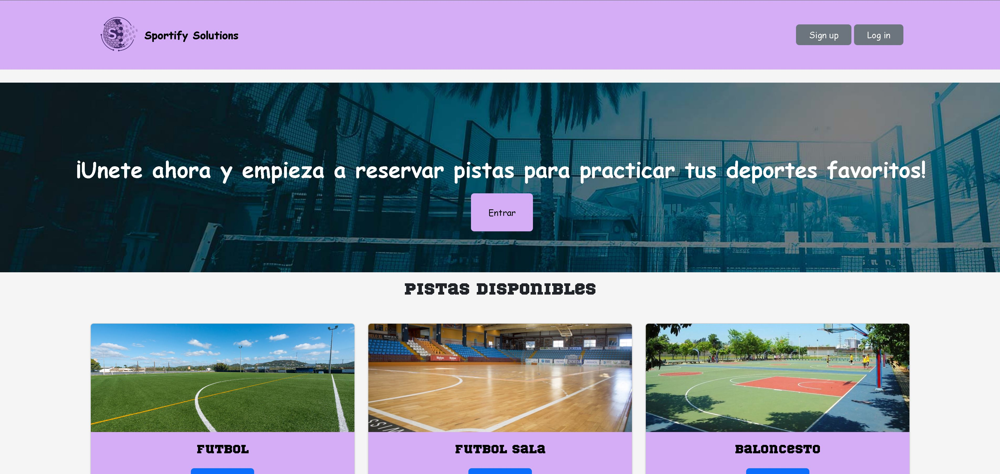

# Trabajo Final de Grado
## Sportify Solutions
### Emilio Melero 2º CFSW

#### Base de datos del trabajo

#### Pagina principal de la aplicacion

#### Pagina principal de sign up

#### Pagina principal de log in

#### Pagina principal identificado

#### Pagina de hacerte socio (NO es necesario ser socio pero tienes la posibilidad de hacerlo)

#### Pagina de reservas

#### Pagina de ver el perfil con los datos del socio

#### Pagina de edicion del socio 

#### Pagina del listado personal de reservas de cada socio

#### Pagina principal en modo de administrador (usuario: admin, contraseña: admin)

#### Pagina agregar pista

#### Pagina de registro de todos los usuarios que SI son socios

#### Pagina de reservas generales. Registradas todas las reservas de todos los usuarios
